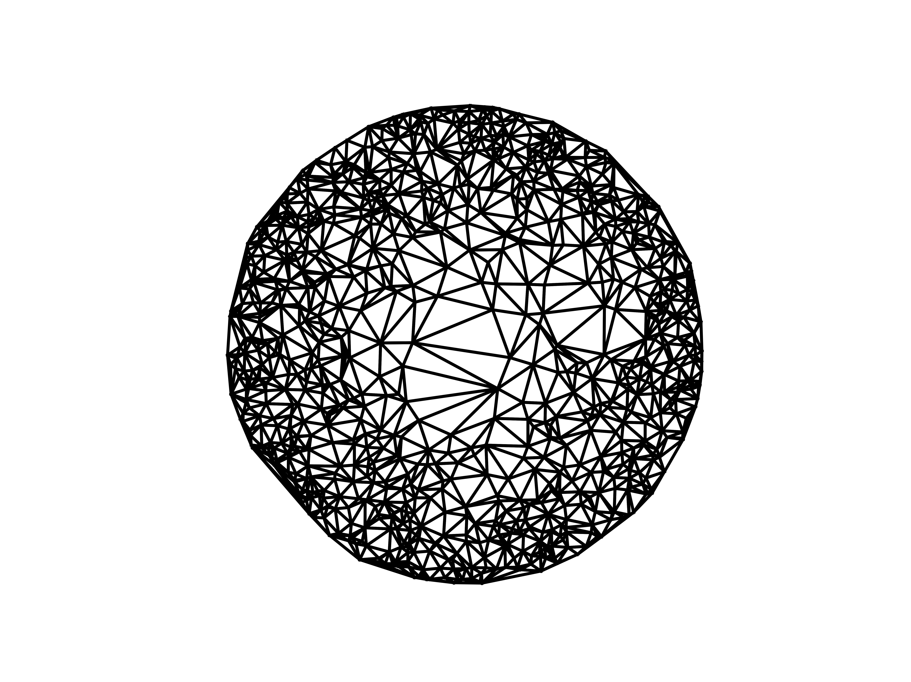

This is a repo for my project completed for my MSc in High Performance Computing. 

The main structure of this repo is as follows.
In the root directory you find the report for this project in "thesis.pdf"
along with the accompanying ".typ" typst source.

The "main" directory contains all of the source code for both serial
and parallel implementaions in "main/serialIncPtInsertion" and "main/gpu"
respectively and all plotting scripts in "main/plotting". Both 
the serial and parallel implementaions have the same structure and will
both create relevent executables in "bin" with the "make" command.
When compiling GPU code remember to change the compile flags in the
makefile to suit your GPU.

    main
     ├── gpu
     │   ├── Makefile
     │   ├── bin
     │   ├── obj
     │   └── src
     ├── plotting
     │   ├── blockSizeVsTime
     │   ├── floatVsDouble
     │   ├── gpuModelTest
     │   ├── makeAll.sh
     │   ├── nflipsVsIter
     │   ├── ninsertVsIter
     │   ├── nptsVsSpeedup
     │   ├── nptsVsTime
     │   ├── plot.py
     │   ├── serial_nptsVsTime
     │   ├── serial_triangulation
     │   ├── timeDistrib
     │   ├── triangulation_grid
     │   ├── triangulation_history
     │   └── triangulation_onlyptins
     └── serialIncPtInsertion
         ├── Makefile
         ├── bin
         ├── data
         ├── obj
         └── src

